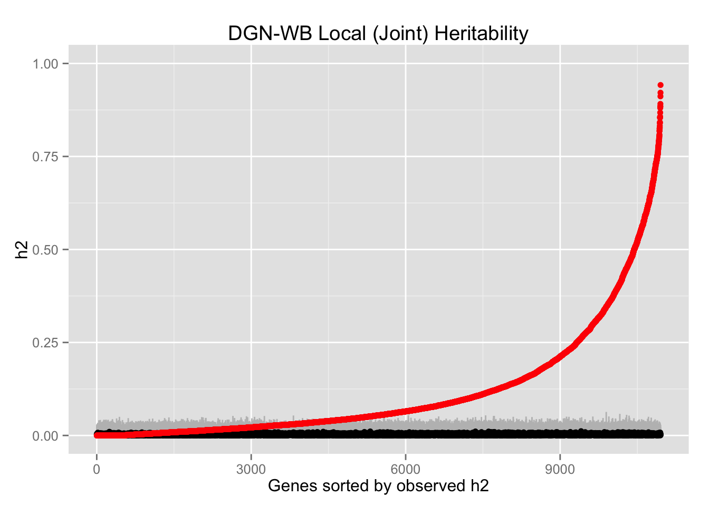

## PrediXcan Step 1: Build and Test Predictors


## PrediXcan Step 2: Build database of Best Predictors


## PrediXcan Step 3: Impute gene expression and test for association with phenotype


##Explore the Genetic Architecture of Transcriptome Regulation 

Optimizing predictors for PrediXcan also tells us about the underlying genetic architecture of gene expression.

We can ask what proportion of genes have:

- *cis* vs. *trans* effects 
- sparse vs. polygenic effects
- cross-tissue vs. tissue-specific effects

##Primary cohort: DGN
- Battle et al. “Characterizing the genetic basis of transcriptome diversity through RNA-sequencing of 922 individuals.” Genome Research 2014, 24(1):14-24
- Whole blood from Depression Genes and Networks study
- n = 922
- RNA-seq: "normalized gene-level expression data used for trans-eQTL analysis. The data was normalized using HCP (Hidden Covariates with Prior) where the parameters were optimized for detecting 'trans' trends"
- 600K genotypes: I have imputed to 1000 Genomes, but some earlier analyses were genotyped data only.

##*cis* vs. *trans* effects
Estimate the heritability of gene expression in a joint analysis: localGRM (SNPs w/in 1Mb) + globalGRM (all SNPs)


##Local (joint) sorted h^2^ estimates with 95% CI from GCTA


\tiny https://github.com/hwheeler01/cross-tissue/blob/master/analysis/sources/heritab_analysis.html

##Global (joint) sorted h^2^ estimates with 95% CI from GCTA


\tiny https://github.com/hwheeler01/cross-tissue/blob/master/analysis/sources/heritab_analysis.html

##100 permutations to determine expected distribution of h^2^ estimates
<!--I performed 100 resampling permutations for heritability estimation, shuffling the gene expression labels for the DGN-WB. Points are the median h^2^ of the 100 permutations, \textcolor{gray}{95\% CI}, \textcolor{red}{h2}-->


##100 permutations to determine expected distribution of h^2^ estimates
<!--I performed 100 resampling permutations for heritability estimation, shuffling the gene expression labels for the DGN-WB. Points are the median h^2^ of the 100 permutations, \textcolor{gray}{95\% CI}, \textcolor{red}{h2}-->


##Sort the h^2^ from each permutation
<!--Plotted in <span style="color:gray">gray</span> is the sorted h<sup>2</sup> from each permutation and in <span style="color:red">red</span> is the sorted h<sup>2</sup> from the observed data.-->


##Sort the h^2^ from each permutation
<!--Plotted in <span style="color:gray">gray</span> is the sorted h<sup>2</sup> from each permutation and in <span style="color:red">red</span> is the sorted h<sup>2</sup> from the observed data.-->


##Sort the h^2^ from each permutation
<!--Plotted in <span style="color:gray">gray</span> is the sorted h<sup>2</sup> from each permutation and in <span style="color:red">red</span> is the sorted h<sup>2</sup> from the observed data.-->


##*cis* vs. *trans* effects
Try a larger sample to better caputure *trans* effects

**Framingham Heart Study**

- n = 5257
- exon expression array and genotype array

##sparse vs. polygenic effects
`glmnet` solves the following problem <span class="math">\[
\min_{\beta_0,\beta} \frac{1}{N} \sum_{i=1}^{N} w_i l(y_i,\beta_0+\beta^T x_i) + \lambda\left[(1-\alpha)||\beta||_2^2/2 + \alpha ||\beta||_1\right],
\]</span> over a grid of values of <span class="math">\(\lambda\)</span> covering the entire range. 

The <em>elastic-net</em> penalty is controlled by <span class="math">\(\alpha\)</span>, and bridges the gap between lasso (<span class="math">\(\alpha=1\)</span>, the default) and ridge (<span class="math">\(\alpha=0\)</span>). The tuning parameter <span class="math">\(\lambda\)</span> controls the overall strength of the penalty.

\small <http://web.stanford.edu/~hastie/glmnet/glmnet_alpha.html>

##sparse vs. polygenic effects


For each gene, determine <span class="math">\(\alpha\)</span> with best 10-fold CV predictive performance using *cis* SNPs.

##Predictive performance consistent across most alphas


##Predictive performance consistent between <span class="math">\(\alpha\)</span>=0.5 and <span class="math">\(\alpha\)</span>=1


##Also tested Polyscore predictive performance using 10-fold CV
$expression = \sum\hat{w}*gt$

Single variant linear regression coefficients ($w$) at several P-value thresholds included in the additive model:

- $P<0.0001$
- $P<0.001$
- $P<0.01$
- $P<0.05$
- $P<0.5$
- $P<1$

##Polyscore (*cis* SNPs only) predictive performance


##Polyscore (*cis* SNPs only) predictive performance


##LASSO predicts gene expression better than Polyscore


##For robustness, consider EN (alpha=0.5) for PrediXcan
\begin{columns}[c]  %the "c" option specifies center vertical alignment
\column{.5\textwidth}  %column designated by a command
  \includegraphics[height=3in]{figs/nsnps.png}
\column{.5\textwidth}
  \includegraphics[height=3in]{figs/nsnpsZoom.png}
\end{columns}

## cross-tissue vs. tissue-specific effects with GTEx


## Modeling cross-tissue expression
Linear mixed effect model

```{r,eval=F}
library(lme4)

fit <- lmer(expression ~ (1|SUBJID) + TISSUE 
+ GENDER + PEERs) 

#cross-tissue expression
fitranef <- ranef(fit) 

#tissue-specific expression
fitresid <- resid(fit) 
```

##Estimating heritability with GCTA

Tested two genetic relationship matrix (GRM) models for each expressed gene

- localGRM (SNPs within 1 Mb of gene)
- localGRM + globalGRM (all SNPs)

First pass: estimated h^2^ of cross-tissue expression and tissue-specific expression in the 7 tissues with the most samples

##GCTA heritability: Y ~ localGRM h2


##GCTA heritability: Y ~ localGRM h2 **ZOOM**


##GCTA heritability: Y ~ localGRM p-values


##GCTA heritability: Y ~ localGRM + globalGRM h2 


##GCTA heritability: Y ~ localGRM + globalGRM h2 


##GCTA heritability: Y ~ localGRM + globalGRM SE 
