transPCA: taking the h2 out of PEER
========================================================
author: Heather Wheeler
date: 2017-03-17 11:31:07
autosize: true

Local and global h2 of gene expression in DGN whole blood
========================================================

***Wheeler et al. 2016, PLOS Genetics***

transPCA
========================================================
- Gene expression data is usually adjusted for hidden confounders using SVA (surrogate variable analysis) or PEER (probabilistic estimation of expression residuals) prior to eQTL or h2 analyses
- Haky and Keston observed that the PEER factors themselves can have a significant h2 estimate (PF variance explained by the SNPs)
- Thus, we may be ***overadjusting*** when we estimate global h2 with PEER-adjusted gene expression
    - ***throwing the baby out with the bath water***
- We may need to adjust the adjusters (PFs)

Preliminary analyses in DGN whole blood (n=922)
========================================================
1. Calculate PEER factors in DGN
    - Nk = 20, 40, 60, 80, 100
2. Calculate PF h2 using GCTA
    - if h2 is non-zero, we are losing information
3. Adjust each PF by removing the total genetic effect with BLUP (best linear unbiased prediction)
    - the adjusted PF is the residuals
4. Does adjusting gene expression by adjPFs give larger global h2 estimates than adjusting by the original PFs?


GCTA h2 of each PEER Factor, Nk = 20
========================================================

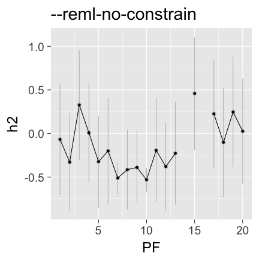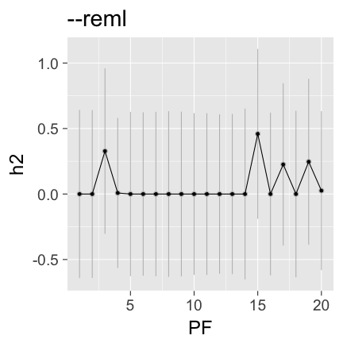

GCTA h2 of each PEER Factor, Nk = 40
========================================================

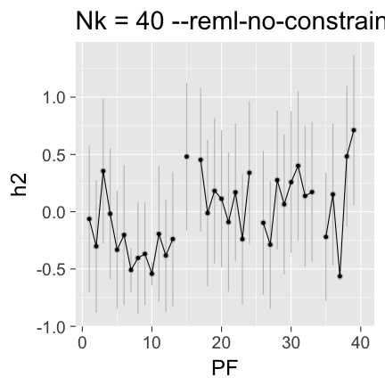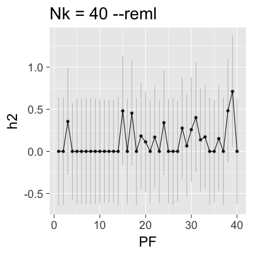

GCTA h2 of each PEER Factor, Nk = 60
========================================================

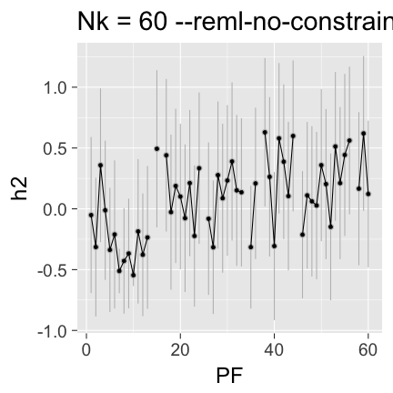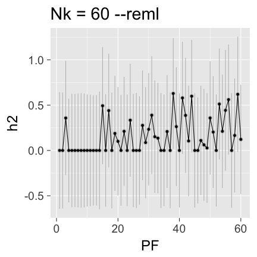

GCTA h2 of each PEER Factor, Nk = 100
========================================================

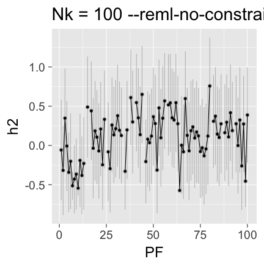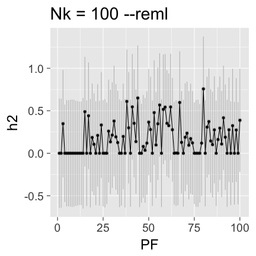

Take out the genetic component of each PEER factor
========================================================
Use GCTA to predict the random effects by the BLUP (best linear unbiased prediction) method:

`--reml-pred-rand`

Outfile:    `*.indi.blp` 

columns are family ID, individual ID, an intermediate variable, the total genetic effect (breeding value),  another intermediate variable and the ***residual effect***.

The ***residual effect*** is our adjusted PEER factor (adjPF).

GCTA command to get adjusted PEER factors
========================================================
`gcta64 --reml-no-constrain --grm Chr1-22 --mpheno PFs --pheno i --reml-pred-rand --reml-maxit 1000 --out results`

<https://github.com/hwheeler01/GenArch/tree/master/expArch_DGN-WB_imputedGTs/transPCA>

`/group/im-lab/nas40t2/hwheeler/cross-tissue/expArch_DGN-WB_imputedGTs/transPCA/`

GCTA h2 of each PEER Factor, Nk = 20
========================================================

| PF|     h2|    se|     p|
|--:|------:|-----:|-----:|
|  1| -0.068| 0.320| 0.428|
|  2| -0.329| 0.280| 0.195|
|  3|  0.328| 0.316| 0.160|
|  4|  0.008| 0.286| 0.489|
|  5| -0.324| 0.263| 0.168|
|  6| -0.200| 0.305| 0.288|
|  7| -0.511| 0.091| 0.032|
|  8| -0.415| 0.229| 0.137|
|  9| -0.390| 0.208| 0.097|
| 10| -0.532| 0.067| 0.048|

***


|   | PF|     h2|    se|     p|
|:--|--:|------:|-----:|-----:|
|11 | 11| -0.193| 0.298| 0.285|
|12 | 12| -0.380| 0.253| 0.138|
|13 | 13| -0.227| 0.295| 0.251|
|14 | 14|     NA|    NA|    NA|
|15 | 15|  0.459| 0.324| 0.096|
|16 | 16|     NA|    NA|    NA|
|17 | 17|  0.226| 0.310| 0.238|
|18 | 18| -0.102| 0.314| 0.389|
|19 | 19|  0.247| 0.317| 0.232|
|20 | 20|  0.026| 0.303| 0.468|

adjPF (BLUP resid) vs. PF
========================================================
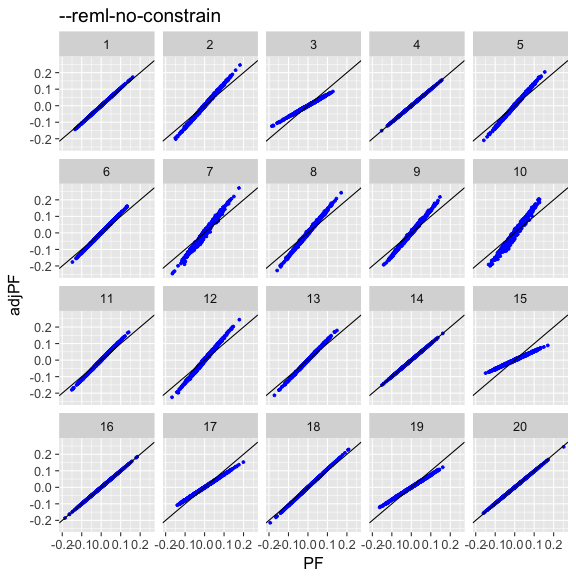

DGN global expression h2 (PF vs. adjPF)
========================================================

```
[1] "Nk=20 global h2"
```

```
       PF              adjPF        
 Min.   :-0.9302   Min.   :-0.9123  
 1st Qu.:-0.1136   1st Qu.:-0.0919  
 Median : 0.1237   Median : 0.1380  
 Mean   : 0.1437   Mean   : 0.1595  
 3rd Qu.: 0.3690   3rd Qu.: 0.3749  
 Max.   : 2.3662   Max.   : 2.3765  
 NA's   :1000      NA's   :549      
```

DGN global expression h2 (PF vs. adjPF)
========================================================
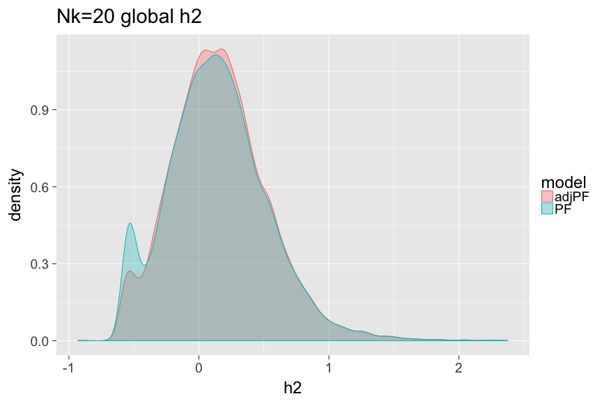

DGN global expression h2 (PF vs. adjPF)
========================================================

```
[1] "Nk=40 global h2"
```

```
       PF              adjPF        
 Min.   :-1.3357   Min.   :-1.0523  
 1st Qu.:-0.1161   1st Qu.:-0.0748  
 Median : 0.1289   Median : 0.1612  
 Mean   : 0.1551   Mean   : 0.1862  
 3rd Qu.: 0.3914   3rd Qu.: 0.4090  
 Max.   : 2.4599   Max.   : 2.4883  
 NA's   :1046      NA's   :430      
```

DGN global expression h2 (PF vs. adjPF)
========================================================
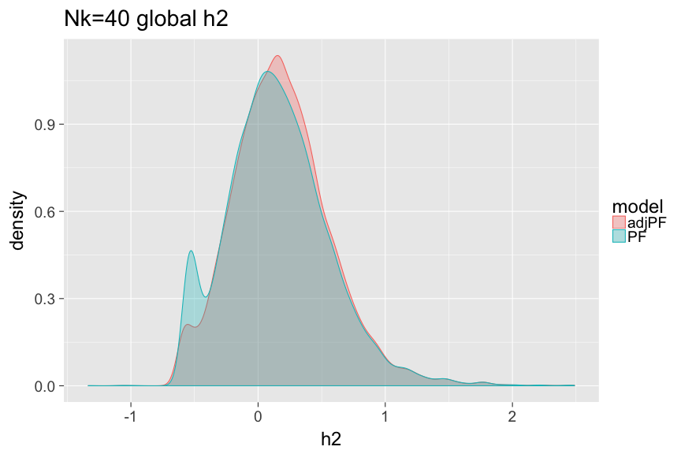

DGN global expression h2 (PF vs. adjPF)
========================================================

```
[1] "Nk=60 global h2"
```

```
       PF              adjPF        
 Min.   :-1.1596   Min.   :-0.9919  
 1st Qu.:-0.1206   1st Qu.:-0.0835  
 Median : 0.1317   Median : 0.1593  
 Mean   : 0.1583   Mean   : 0.1880  
 3rd Qu.: 0.3996   3rd Qu.: 0.4173  
 Max.   : 2.4702   Max.   : 2.4720  
 NA's   :1241      NA's   :697      
```

DGN global expression h2 (PF vs. adjPF)
========================================================
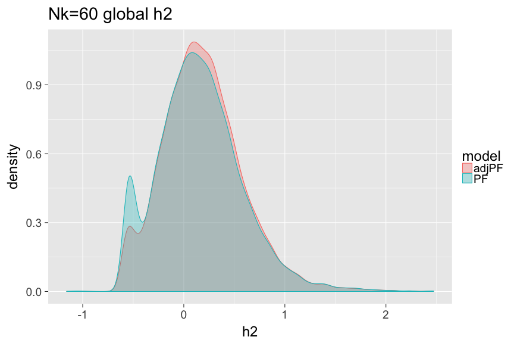

DGN global expression h2 (PF vs. adjPF)
========================================================

```
[1] "Nk=100 global h2"
```

```
       PF              adjPF        
 Min.   :-1.4812   Min.   :-0.7633  
 1st Qu.:-0.1162   1st Qu.:-0.0506  
 Median : 0.1497   Median : 0.2038  
 Mean   : 0.1745   Mean   : 0.2289  
 3rd Qu.: 0.4334   3rd Qu.: 0.4760  
 Max.   : 2.5649   Max.   : 2.5722  
 NA's   :1725      NA's   :643      
```

DGN global expression h2 (PF vs. adjPF)
========================================================
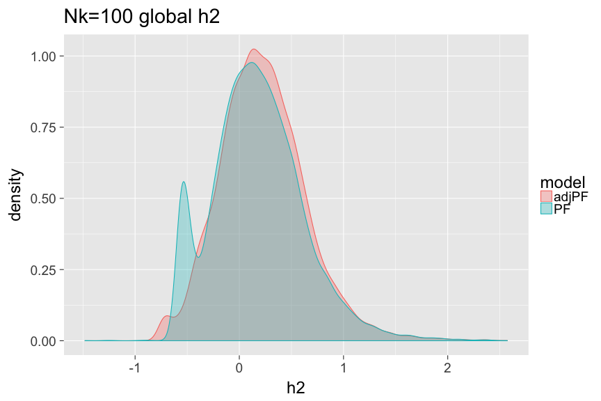

Next
========================================================
- Expression h2 shift to the right is promising
- The DGN expression data I used here was already adjusted prior to my PF or adjPF adjustment
    - HCP (hidden covariates with prior) normalized gene-level expression data used for the trans-eQTL analysis in Battle et al. 2013
    - Go back and redo from pre-adjusted RPKM
- Try GTEx and Framingham (how many PFs? 100?)
- Ideas?
