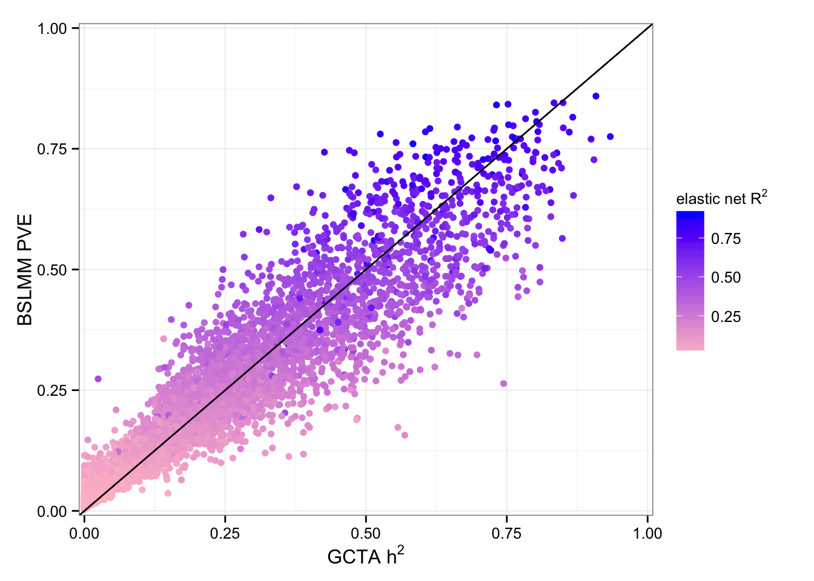
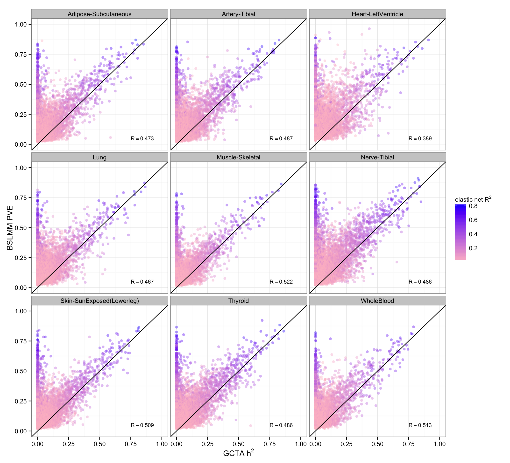
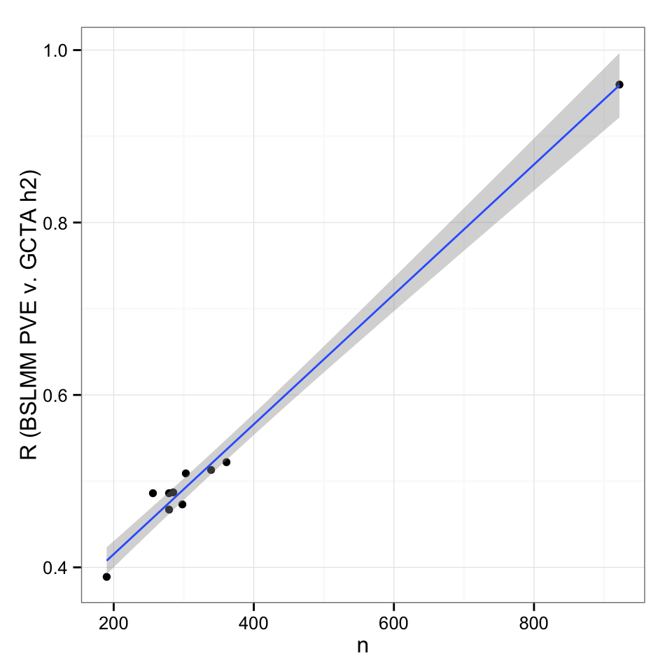
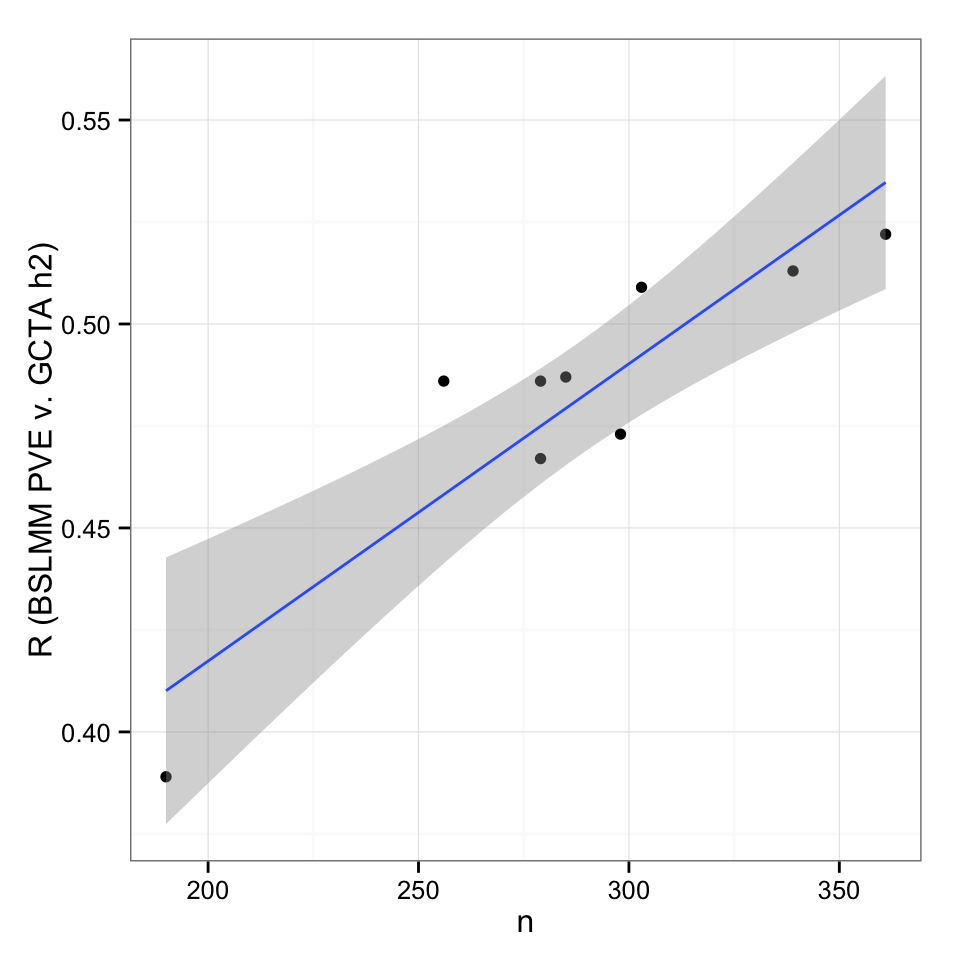
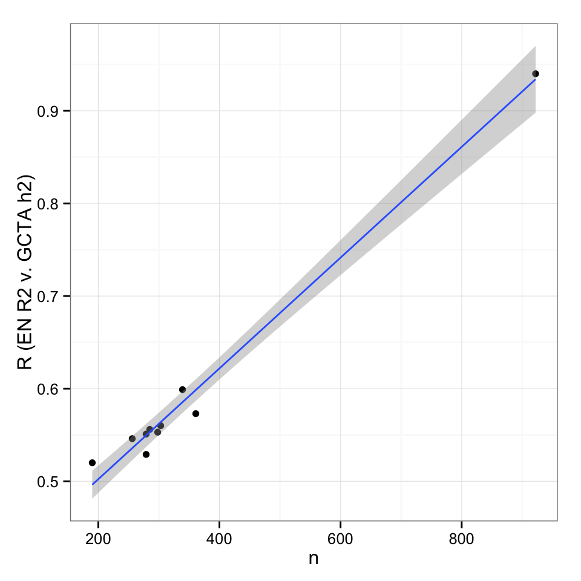
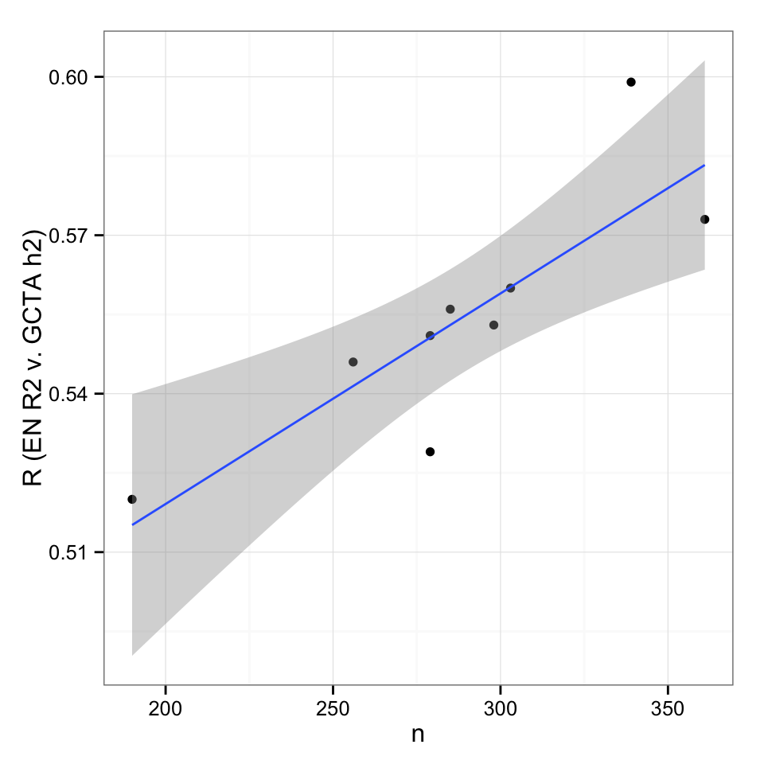

```r
  library(ggplot2)
  library(reshape2)
  library(dplyr)
  library(tidyr)
  library(GGally)
  library(grid)
  library(corrplot)
  "%&%" = function(a,b) paste(a,b,sep="")
  source('/Volumes/im-lab/nas40t2/hwheeler/cross-tissue/GenArchPaper/multiplot.R')
  my.dir <- '/Volumes/im-lab/nas40t2/hwheeler/cross-tissue/'
  fig.dir <- '~/GitHub/GenArch/GenArchPaper/Figures/'
  my.vol <- '/Volumes/im-lab/nas40t2/hwheeler/cross-tissue/BSLMM_exp/'
  rna.dir <- my.dir %&% "gtex-rnaseq/"
  out.dir <- rna.dir %&% "ind-tissues-RPKM/"
  dgn.dir <- '/Volumes/im-lab/nas40t2/hwheeler/PrediXcan_CV/GTEx_2014-06013_release/transfers/PrediXmod/DGN-WB/DGN-calc-weights/'
```

###DGN

```r
gcta <- read.table('/Volumes/im-lab/nas40t2/hwheeler/cross-tissue/expArch_DGN-WB_imputedGTs/DGN-WB.h2.all.models_FHSfdr0.05.all.Chr1-22_globalOtherChr.2015-03-18.txt',header=TRUE) %>% dplyr::select(gene,local.h2)
bslmm <- read.table(my.dir %&% 'DGN-WB_exp_BSLMM-s100K_iterations_all_genes_2015-06-14.txt',header=T)
alpha50 <- read.table(dgn.dir %&% 'DGN-WB_exp_10-foldCV_elasticNet_alpha0.5_hapmapSnpsCEU_chr1-22_2015-02-02.txt',header=TRUE) %>% dplyr::select(gene,R2)
all <- inner_join(gcta,alpha50,by='gene')
all <- inner_join(all,bslmm,by='gene')
all <- all[complete.cases(all),]
ggplot(all,aes(x=local.h2,y=pve50,color=R2)) + geom_point() +coord_cartesian(xlim=c(-0.01,1.01),ylim=c(-0.01,1.01)) + theme_bw() +xlab(expression("GCTA h"^2))+ylab('BSLMM PVE')+geom_abline(c(0,1)) + scale_colour_gradient(low="pink",high="blue",name=expression("elastic net R"^2)) 
```



```r
cor.test(all$local.h2,all$R2)
```

```
## 
## 	Pearson's product-moment correlation
## 
## data:  all$local.h2 and all$R2
## t = 285.03, df = 11157, p-value < 2.2e-16
## alternative hypothesis: true correlation is not equal to 0
## 95 percent confidence interval:
##  0.9354043 0.9398864
## sample estimates:
##       cor 
## 0.9376844
```

```r
cor.test(all$local.h2,all$pve50)
```

```
## 
## 	Pearson's product-moment correlation
## 
## data:  all$local.h2 and all$pve50
## t = 336.66, df = 11157, p-value < 2.2e-16
## alternative hypothesis: true correlation is not equal to 0
## 95 percent confidence interval:
##  0.9524465 0.9557732
## sample estimates:
##       cor 
## 0.9541393
```

```r
cor.test(all$pve50,all$R2)
```

```
## 
## 	Pearson's product-moment correlation
## 
## data:  all$pve50 and all$R2
## t = 627.95, df = 11157, p-value < 2.2e-16
## alternative hypothesis: true correlation is not equal to 0
## 95 percent confidence interval:
##  0.9856261 0.9866475
## sample estimates:
##       cor 
## 0.9861461
```

###GTEx TW

```r
tislist <- scan('/Volumes/im-lab/nas40t2/hwheeler/cross-tissue/nine.tissue.list',sep="\n",what="character")
tw <- data.frame()
rvec<-vector()
nvec<-vector()
rvec2<-vector()
for(i in 1:length(tislist)){
  tis <- tislist[i]
  bs <- read.table(my.vol %&% tislist[i] %&% '_TW_exp_BSLMM-s100K_iterations_all_chr1-22_2015-10-18.txt',header=T,sep="\t") %>% dplyr::select(gene,pve50) %>% rename(ensid=gene)
  h2 <- read.table("/Volumes/im-lab/nas40t2/hwheeler/cross-tissue/gtex-h2-estimates/GTEx.tissue-wide.h2_" %&% tislist[i] %&% "_marginal.local_2015-03-24.txt",header=T, sep="\t") %>% dplyr::select(tissue,ensid,gene,h2,N)
  alpha50 <- read.table(my.dir %&% 'gtex-OTD-CV-R2/TW_' %&% tis %&% '_exp_10-foldCV_elasticNet_alpha0.5_hapmapSnpsCEU_all_chr1-22_2015-09-10.txt',header=TRUE) %>%dplyr::select(gene,R2)
  explist <- scan(out.dir %&% tis %&% ".meanRPKMgt0.1_3samplesRPKMgt0_genelist","c")
  h2 <- dplyr::filter(h2,ensid %in% explist)
  subdata <- inner_join(h2,bs,by="ensid")
  subdata <- inner_join(subdata,alpha50,by='gene')
  subdata <- subdata[complete.cases(subdata),] #uncomment to remove gray points 
  print(dim(subdata))
  res<-cor.test(subdata$pve50,subdata$h2)
  cat(tislist[i],"\tPearson R (PVE v h2)=",round(res$estimate,3),"\tP-value=",res$p.value,"\n")
  rvec <- cbind(rvec,unname(round(res$estimate,3)))
  res2<-cor.test(subdata$R2,subdata$h2)
  cat(tislist[i],"\tPearson R (EN R2 v h2)=",round(res2$estimate,3),"\tP-value=",res2$p.value,"\n")
  rvec2 <- cbind(rvec2,unname(round(res2$estimate,3)))
  nvec <- cbind(nvec,h2$N[1])
  tw <- rbind(tw,subdata)
}
```

```
## [1] 9000    7
## Adipose-Subcutaneous 	Pearson R (PVE v h2)= 0.473 	P-value= 0 
## Adipose-Subcutaneous 	Pearson R (EN R2 v h2)= 0.553 	P-value= 0 
## [1] 8637    7
## Artery-Tibial 	Pearson R (PVE v h2)= 0.487 	P-value= 0 
## Artery-Tibial 	Pearson R (EN R2 v h2)= 0.556 	P-value= 0 
## [1] 7698    7
## Heart-LeftVentricle 	Pearson R (PVE v h2)= 0.389 	P-value= 0 
## Heart-LeftVentricle 	Pearson R (EN R2 v h2)= 0.52 	P-value= 0 
## [1] 8862    7
## Lung 	Pearson R (PVE v h2)= 0.467 	P-value= 0 
## Lung 	Pearson R (EN R2 v h2)= 0.551 	P-value= 0 
## [1] 8029    7
## Muscle-Skeletal 	Pearson R (PVE v h2)= 0.522 	P-value= 0 
## Muscle-Skeletal 	Pearson R (EN R2 v h2)= 0.573 	P-value= 0 
## [1] 9726    7
## Nerve-Tibial 	Pearson R (PVE v h2)= 0.486 	P-value= 0 
## Nerve-Tibial 	Pearson R (EN R2 v h2)= 0.546 	P-value= 0 
## [1] 9380    7
## Skin-SunExposed(Lowerleg) 	Pearson R (PVE v h2)= 0.509 	P-value= 0 
## Skin-SunExposed(Lowerleg) 	Pearson R (EN R2 v h2)= 0.56 	P-value= 0 
## [1] 9569    7
## Thyroid 	Pearson R (PVE v h2)= 0.486 	P-value= 0 
## Thyroid 	Pearson R (EN R2 v h2)= 0.529 	P-value= 0 
## [1] 7651    7
## WholeBlood 	Pearson R (PVE v h2)= 0.513 	P-value= 0 
## WholeBlood 	Pearson R (EN R2 v h2)= 0.599 	P-value= 0
```

```r
##plot R2 vs. h2
p<-ggplot(tw,aes(x=h2,y=pve50,color=R2))+geom_point(alpha=0.4)+coord_cartesian(xlim=c(-0.05,1.05),ylim=c(-0.05,1.05))+xlab(expression("GCTA h"^2))+ylab('BSLMM PVE')+geom_abline(c(0,1)) + scale_colour_gradient(low="pink",high="blue",name=expression("elastic net R"^2)) + facet_wrap(~tissue,ncol=3)+theme_bw()

ann_text <- data.frame( h2 = rep(0.75,9), pve50 = rep(0.05,9), R= rvec[1:9], tissue = factor(tislist), ensid=rep(0.9,9),gene=rep(0.9,9))
p2<-p+geom_text(data=ann_text,aes(label=paste("R==",R,sep="")),color="black",show_guide=F,parse=T,hjust=0,size=3)
p2
```



```r
png(filename=fig.dir %&% "Fig-GTEx_TW_colorEN0.5R2_pve_v_h2.png",width=700,height=600)
p2
dev.off()
```

```
## quartz_off_screen 
##                 2
```

### R vs. N

```r
##plot R (PVE vs. h2) vs. N
n<-c(nvec, 922)
R<-c(rvec,0.96)
nvr <- data.frame(n,R)
ggplot(nvr,aes(x=n,y=R)) + geom_point() + geom_smooth(method="lm") + theme_bw() + ylab("R (BSLMM PVE v. GCTA h2)")
```



```r
cor.test(nvr$R,nvr$n)
```

```
## 
## 	Pearson's product-moment correlation
## 
## data:  nvr$R and nvr$n
## t = 28.096, df = 8, p-value = 2.782e-09
## alternative hypothesis: true correlation is not equal to 0
## 95 percent confidence interval:
##  0.9780600 0.9988548
## sample estimates:
##      cor 
## 0.994971
```

```r
ggplot(nvr[1:9,],aes(x=n,y=R)) + geom_point() + geom_smooth(method="lm") + theme_bw() + ylab("R (BSLMM PVE v. GCTA h2)")
```



```r
cor.test(nvr[1:9,]$R,nvr[1:9,]$n)
```

```
## 
## 	Pearson's product-moment correlation
## 
## data:  nvr[1:9, ]$R and nvr[1:9, ]$n
## t = 5.6999, df = 7, p-value = 0.0007354
## alternative hypothesis: true correlation is not equal to 0
## 95 percent confidence interval:
##  0.6109661 0.9805162
## sample estimates:
##       cor 
## 0.9070479
```

```r
##plot R (EN R2 vs. h2) vs. N
n<-c(nvec, 922)
R<-c(rvec2,0.94)
nvr <- data.frame(n,R)
ggplot(nvr,aes(x=n,y=R)) + geom_point() + geom_smooth(method="lm") + theme_bw() + ylab("R (EN R2 v. GCTA h2)")
```



```r
cor.test(nvr$R,nvr$n)
```

```
## 
## 	Pearson's product-moment correlation
## 
## data:  nvr$R and nvr$n
## t = 23.065, df = 8, p-value = 1.325e-08
## alternative hypothesis: true correlation is not equal to 0
## 95 percent confidence interval:
##  0.9676940 0.9983053
## sample estimates:
##       cor 
## 0.9925648
```

```r
ggplot(nvr[1:9,],aes(x=n,y=R)) + geom_point() + geom_smooth(method="lm") + theme_bw() + ylab("R (EN R2 v. GCTA h2)")
```



```r
cor.test(nvr[1:9,]$R,nvr[1:9,]$n)
```

```
## 
## 	Pearson's product-moment correlation
## 
## data:  nvr[1:9, ]$R and nvr[1:9, ]$n
## t = 4.1141, df = 7, p-value = 0.004492
## alternative hypothesis: true correlation is not equal to 0
## 95 percent confidence interval:
##  0.4009135 0.9657547
## sample estimates:
##       cor 
## 0.8410904
```
